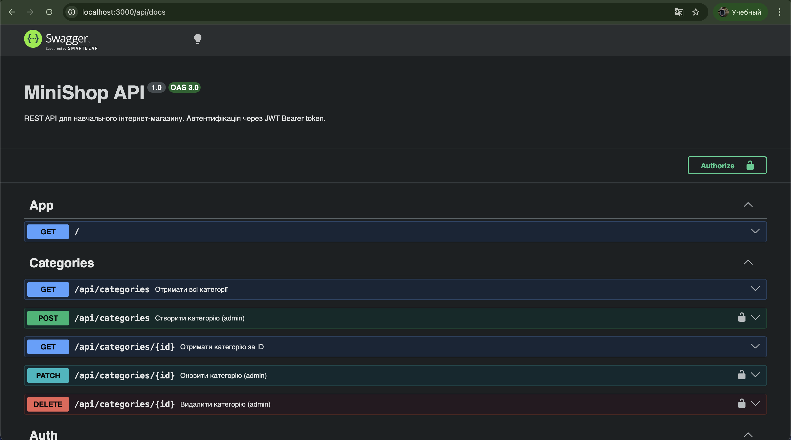

## Student
- Name: Рохмаков Артем Сергійович
- Group: 232/2 он

## MiniShop API — Фінальний проєкт

REST API інтернет-магазину на NestJS + PostgreSQL + Redis.

### Технології
- NestJS + TypeScript
- PostgreSQL + TypeORM (міграції, QueryBuilder)
- Redis (кешування з інвалідацією)
- JWT автентифікація + RBAC авторизація
- class-validator + class-transformer
- Swagger / OpenAPI

### Структура репозиторію
```
.
├── src/
│   ├── auth/
│   │   ├── dto/
│   │   │   ├── register.dto.ts
│   │   │   └── login.dto.ts
│   │   ├── auth.module.ts
│   │   ├── auth.service.ts
│   │   └── auth.controller.ts
│   ├── users/
│   │   ├── user.entity.ts
│   │   ├── users.module.ts
│   │   └── users.service.ts
│   ├── categories/
│   │   ├── dto/
│   │   │   ├── create-category.dto.ts
│   │   │   └── update-category.dto.ts
│   │   ├── category.entity.ts
│   │   ├── categories.module.ts
│   │   ├── categories.service.ts
│   │   └── categories.controller.ts
│   ├── products/
│   │   ├── dto/
│   │   │   ├── create-product.dto.ts
│   │   │   ├── update-product.dto.ts
│   │   │   └── product-query.dto.ts
│   │   ├── product.entity.ts
│   │   ├── products.module.ts
│   │   ├── products.service.ts
│   │   └── products.controller.ts
│   ├── orders/
│   │   ├── dto/
│   │   │   ├── create-order.dto.ts
│   │   │   ├── create-order-item.dto.ts
│   │   │   ├── update-order-status.dto.ts
│   │   │   └── order-query.dto.ts
│   │   ├── entities/
│   │   │   ├── order.entity.ts
│   │   │   └── order-item.entity.ts
│   │   ├── orders.module.ts
│   │   ├── orders.service.ts
│   │   └── orders.controller.ts
│   ├── common/
│   │   ├── enums/
│   │   │   ├── role.enum.ts
│   │   │   └── order-status.enum.ts
│   │   ├── guards/
│   │   │   ├── jwt-auth.guard.ts
│   │   │   └── roles.guard.ts
│   │   ├── decorators/
│   │   │   ├── current-user.decorator.ts
│   │   │   └── roles.decorator.ts
│   │   ├── interceptors/
│   │   │   ├── logging.interceptor.ts
│   │   │   └── transform.interceptor.ts
│   │   ├── filters/
│   │   │   └── http-exception.filter.ts
│   │   └── pipes/
│   │       └── trim.pipe.ts
│   ├── seeds/
│   │   └── seed.ts
│   ├── migrations/
│   ├── data-source.ts
│   ├── main.ts
│   └── app.module.ts
├── swagger-screenshot.png
├── Dockerfile
├── docker-compose.yml
└── README.md
```

### Запуск
```bash
cp .env.example .env
docker compose up --build
docker compose run --rm app npm run seed
```

### Swagger UI
http://localhost:3000/api/docs



### API Endpoints

#### Auth
| Method | URL | Auth | Опис |
|--------|-----|------|------|
| POST | /auth/register | - | Реєстрація |
| POST | /auth/login | - | Логін → JWT |

#### Categories
| Method | URL | Auth | Опис |
|--------|-----|------|------|
| GET | /api/categories | - | Список |
| GET | /api/categories/:id | - | Одна |
| POST | /api/categories | admin | Створити |
| PATCH | /api/categories/:id | admin | Оновити |
| DELETE | /api/categories/:id | admin | Видалити |

#### Products
| Method | URL | Auth | Опис |
|--------|-----|------|------|
| GET | /api/products | - | Список + pagination + filter |
| GET | /api/products/:id | - | Один |
| POST | /api/products | admin | Створити |
| PATCH | /api/products/:id | admin | Оновити |
| DELETE | /api/products/:id | admin | Видалити |

#### Orders
| Method | URL | Auth | Опис |
|--------|-----|------|------|
| POST | /api/orders | user | Створити замовлення |
| GET | /api/orders | user | Мої / Всі (admin) |
| GET | /api/orders/:id | user | Одне (ownership) |
| PATCH | /api/orders/:id/status | admin | Змінити статус |
| DELETE | /api/orders/:id | admin | Видалити |

### Тест створення замовлення
```text
curl -X POST http://localhost:3000/api/orders -H "Content-Type: application/json" -H "Authorization: Bearer <TOKEN>" -d '{"items":[{"productId":4,"quantity":2},{"productId":5,"quantity":1}]}'

{"data":{"id":1,"status":"pending","totalPrice":"2847.00","user":{"id":1},"items":[{"id":1,"quantity":2,"price":"999.00","product":{"id":4,"name":"iPhone 16",...}},{"id":2,"quantity":1,"price":"849.00","product":{"id":5,"name":"Galaxy S24",...}}],"createdAt":"2026-04-22T17:14:22.299Z"},"statusCode":201,...}
```

### Тест ownership (403)
```text
curl http://localhost:3000/api/orders/1 -H "Authorization: Bearer <ALICE_TOKEN>"

{"error":{"code":403,"message":"You can only view your own orders","traceId":"b1295f68-f732-4efd-af50-1f835978cdb3"},"timestamp":"2026-04-22T17:14:41.660Z"}
```

### Тест зміни статусу
```text
curl -X PATCH http://localhost:3000/api/orders/1/status -H "Content-Type: application/json" -H "Authorization: Bearer <ADMIN_TOKEN>" -d '{"status":"confirmed"}'

{"data":{"id":1,"status":"confirmed","totalPrice":"2847.00","items":[...],"createdAt":"..."},"statusCode":200,...}
```

### Тест невалідного переходу статусу
```text
curl -X PATCH http://localhost:3000/api/orders/1/status -H "Content-Type: application/json" -H "Authorization: Bearer <ADMIN_TOKEN>" -d '{"status":"pending"}'

{"error":{"code":400,"message":"Cannot transition from \"confirmed\" to \"pending\"","traceId":"fd0f6b01-96d6-40b6-901e-880d73be635e"},"timestamp":"2026-04-22T17:14:53.815Z"}
```

### Тест insufficient stock
```text
curl -X POST http://localhost:3000/api/orders -H "Content-Type: application/json" -H "Authorization: Bearer <TOKEN>" -d '{"items":[{"productId":4,"quantity":99999}]}'

{"error":{"code":400,"message":"Insufficient stock for \"iPhone 16\": available 48, requested 99999","traceId":"d28650af-287d-4ff7-b7b1-6584dd9dac7e"},"timestamp":"2026-04-22T17:15:00.550Z"}
```

### Формат успішної відповіді
```json
{
  "data": { ... },
  "statusCode": 200,
  "timestamp": "2026-04-22T17:14:22.316Z"
}
```

### Формат помилки
```json
{
  "error": {
    "code": 400,
    "message": "...",
    "traceId": "..."
  },
  "timestamp": "..."
}
```
